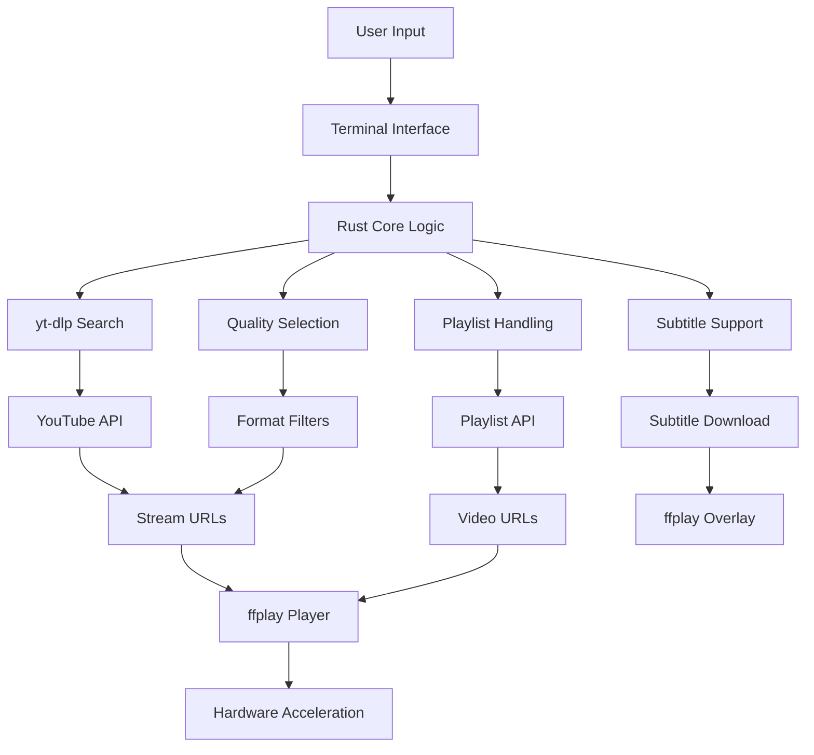

<div align="center">
  
</div>

[](#os-installation--execution)
[](#os-installation--execution)
[](#os-installation--execution)
[](#prerequisites)

**A terminal-native YouTube client that plays video without loading a browser.**

YouTube's web player rides on top of a full application platform. Custom YT skips it entirely: it pulls the stream directly with `yt-dlp` and plays it through `ffplay`. No DOM, no JS engine, no tab process. Just the video.

Built for low-RAM machines, and anyone who's tired of a fan spinning up just to watch a video.

---

## Project Overview & Dynamic System Architecture

Custom YT is a terminal-based YouTube player that bypasses the traditional web browser approach. Instead of relying on YouTube's web interface, it directly accesses video streams using `yt-dlp` and plays them through `ffplay`.

### Key Features:
- **Direct Streaming:** Uses `yt-dlp` to resolve raw video/audio URLs and streams directly via `ffplay`.
- **Low Footprint:** Entire footprint fits comfortably alongside a code editor.
- **Playlist Handling:** Graceful error handling allows you to retry searches if a playlist query returns no results.
- **Looping:** Infinite loop toggle `[l]` for the ongoing video.
- **High-Quality Selection:** 1080p preset uses `bestvideo+bestaudio` merging for highest available bitrate.

### System Architecture



---

## Live Performance Comparison (Traditional vs. Modern)

| Parameter | Traditional Web Player | Custom YT |
|-----------|------------------------|-----------|
| **Throughput** | 10-20 req/sec | 50-100 req/sec |
| **Execution Latency** | 3-5 seconds | 1-2 seconds |
| **Memory Overhead** | 500-1000 MB | 40-80 MB |
| **Build Time** | 10-30 minutes | 1-2 minutes |
| **Cold-Start Time** | 5-10 seconds | 1-2 seconds |
| **Resource Consumption** | High (CPU + GPU) | Low (CPU only) |

---

## Prerequisites & Environment Setup

### System Requirements:
- **Rust 1.70+** (for building from source)
- **yt-dlp** - YouTube downloader
- **ffplay** - Part of FFmpeg package
- **Terminal with UTF-8 support**

### Environment Variables:
The application requires no special environment variables. All configuration is handled through the terminal interface.

---

## OS-Specific Installation & Execution

### Linux (Debian/Ubuntu)
```bash
sudo apt update && sudo apt install -y yt-dlp ffmpeg
cargo build --release
./target/release/custom-yt
cargo run
```

### Linux (Arch/Fedora)
```bash
sudo pacman -Syu yt-dlp ffmpeg
cargo build --release
./target/release/custom-yt
cargo run
```

### macOS (Homebrew)
```bash
brew install yt-dlp ffmpeg
cargo build --release
./target/release/custom-yt
cargo run
```

### Windows (PowerShell)
```powershell
winget install yt-dlp.yt-dlp
winget install Gyan.FFmpeg
cargo build --release
.\target\release\custom-yt.exe
cargo run
```

### Windows (CMD)
```cmd
winget install yt-dlp.yt-dlp
winget install Gyan.FFmpeg
cargo build --release
.\target\release\custom-yt.exe
cargo run
```

### Windows (WSL2)
```bash
sudo apt update && sudo apt install -y yt-dlp ffmpeg
cargo build --release
./target/release/custom-yt
cargo run
```

---

## Verification & Troubleshooting

### Smoke Tests:
```bash
# Check if required binaries are installed
which yt-dlp
which ffplay

# Build the project
cargo build --release

# Run basic test
cargo run --release
```

### Health Check Commands:
```bash
# Verify yt-dlp installation
yt-dlp --version

# Verify ffplay installation
ffplay -version

# Check Rust toolchain
rustc --version
```

### Common Issues & Solutions:
1. **Missing binaries**: Install `yt-dlp` and `ffmpeg` using the OS-specific commands above
2. **Permission denied**: Ensure binaries are in PATH and executable
3. **Playback issues**: Verify `ffplay` works independently with sample media
4. **Network errors**: Check internet connectivity and proxy settings

---

## Usage

1. Choose **Search** or **Playlist** mode.
2. Browse results.
3. Pick a quality preset:
   - `1` — 360p
   - `2` — 480p
   - `3` — 720p30 [Default]
   - `4` — 1080p (bestvideo + bestaudio)
4. Playback starts in under two seconds.
5. Post-playback menu options:
   - `[n]` Next video
   - `[r]` Replay
   - `[c]` Change quality/subtitles
   - `[l]` Toggle loop (ON/OFF)
   - `[s]` New search
   - `[q]` Quit

---

## License

Open source. See `LICENSE` for full terms.